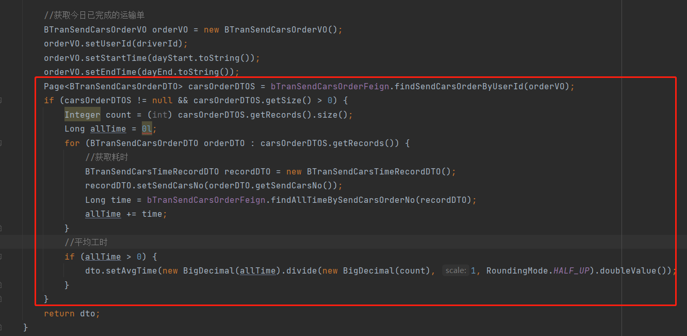
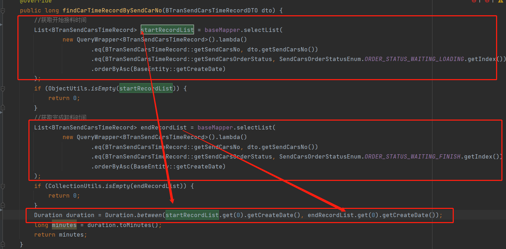
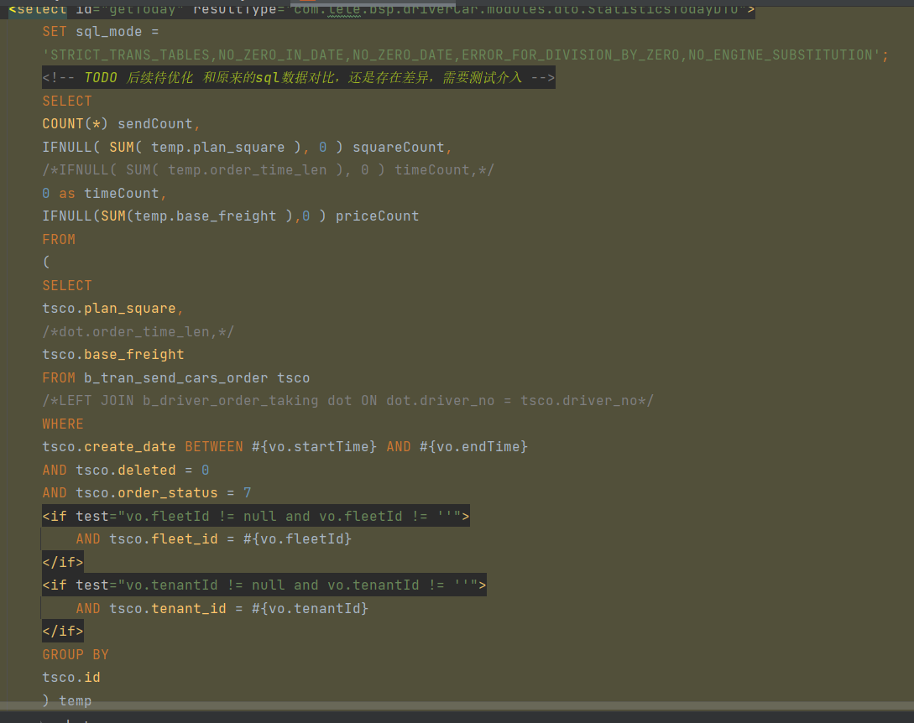
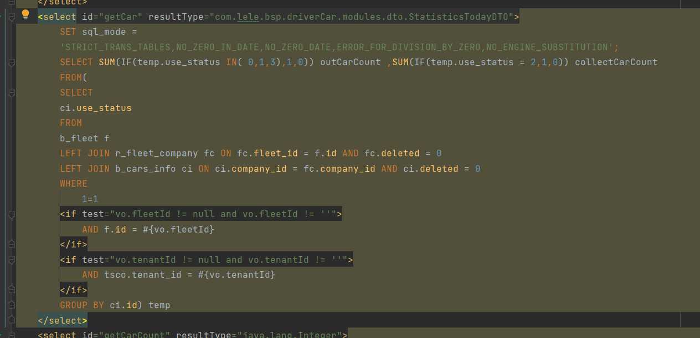
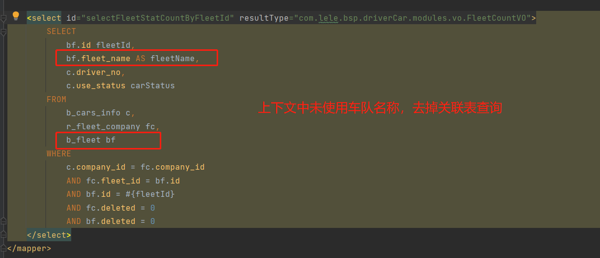
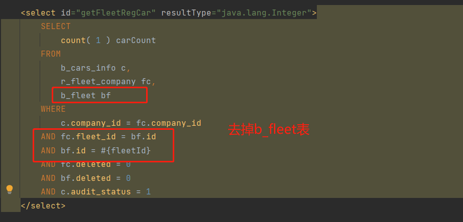
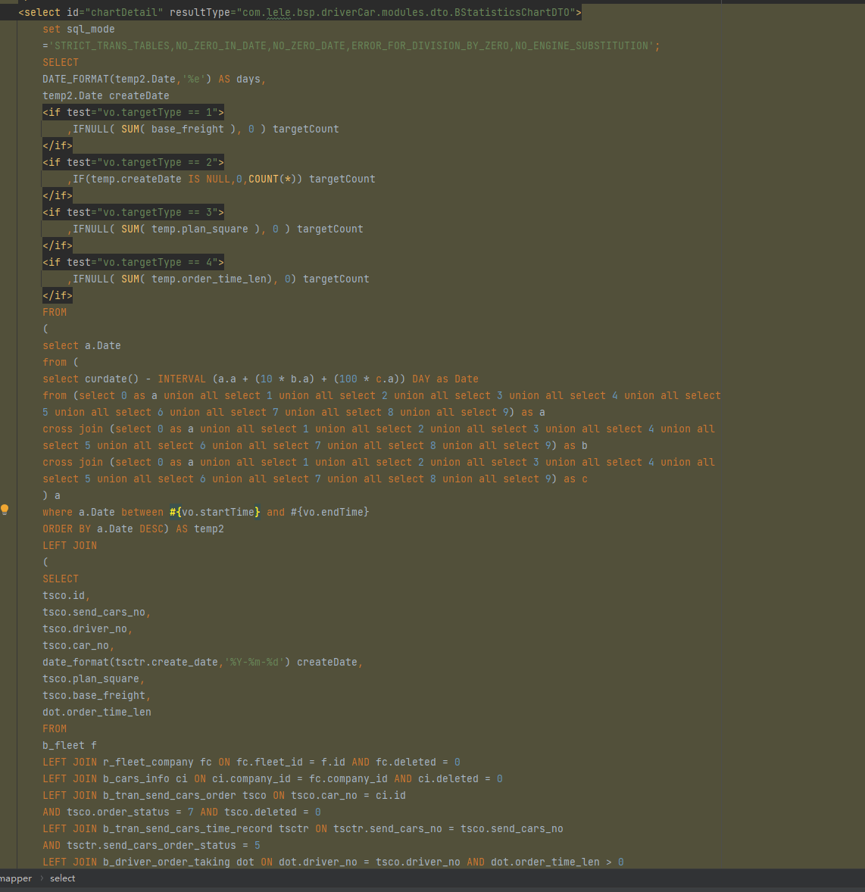
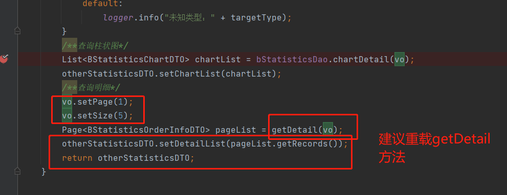

# 司机今日信息[bsp-driver-car/driver/b-driver-info/driver-today-summary](https://testapi.lelegege.com/bsp-driver-car/driver/b-driver-info/driver-today-summary)
## 原sql  发货单表尽量不关联
    SELECT * FROM b_driver_info WHERE user_id = #{userId} AND deleted = 0 LIMIT 1
## 优化后sql
    SELECT <include refid="Base_Column_List" /> FROM b_driver_info WHERE user_id = #{userId} AND deleted = 0 LIMIT 1
### feign
#### bTranSendCarsOrderFeign.findSendCarsOrderByUserId(#BTranSendCarsOrderVO)
* /order/b-tran-send-cars-order/driver-orderByUserId
##### 原sql
````
    final Page<BTranSendCarsOrder> bTranSendCarsOrderPage = query().eq("driver_no", userId)
    .ge(vo.getStartTime() != null, "create_date", vo.getStartTime())
    .le(vo.getEndTime() != null, "create_date", vo.getEndTime())
    .ge("order_status", 6)
    .orderByDesc("create_date").page(new Page<>(vo.getPage(), vo.getSize()));

    //获取发货车次运费费用表
    List<BTranSendCarsOrderFreight> tranSendCarsOrderFreightList = tranSendCarsOrderFreightDao.selectList(
    new QueryWrapper<BTranSendCarsOrderFreight>().eq("send_cars_no", dto.getSendCarsNo())
    .orderByDesc("create_date")
    );
    if (!CollectionUtils.isEmpty(tranSendCarsOrderFreightList)) {
    dto.setTranSendCarsOrderFreight(tranSendCarsOrderFreightList.get(0));
    dto.setCarTotalCost(tranSendCarsOrderFreightList.get(0).getCarTotalCost());


    Page<BTranSendCarsOrderDTO> carsOrderDTOS = bTranSendCarsOrderFeign.findSendCarsOrderByUserId(orderVO);
    if (carsOrderDTOS != null && carsOrderDTOS.getSize() > 0) {
    Integer count = (int) carsOrderDTOS.getRecords().size();
    Long allTime = 0l;
    for (BTranSendCarsOrderDTO orderDTO : carsOrderDTOS.getRecords()) {
    //获取耗时
    BTranSendCarsTimeRecordDTO recordDTO = new BTranSendCarsTimeRecordDTO();
    recordDTO.setSendCarsNo(orderDTO.getSendCarsNo());
    Long time = bTranSendCarsOrderFeign.findAllTimeBySendCarsOrderNo(recordDTO);
    allTime += time;
    }

````


##### 优化方案
feign [driver-today-summary](https://testapi.lelegege.com/bsp-driver-car/driver/b-driver-info/driver-today-summary)
接口调用未分页，feign调用后总条数未使用，建议feign调用不分页

````
    final List<BTranSendCarsOrder> records = query().eq("driver_no", userId)
                .ge(vo.getStartTime() != null, "create_date", vo.getStartTime())
                .le(vo.getEndTime() != null, "create_date", vo.getEndTime())
                .ge("order_status", 6)
                .orderByDesc("create_date").last("LIMIT 0 ,10").list();
        Page<BTranSendCarsOrderDTO> pageX = new Page<>(0,10);
        if (records.isEmpty()) {
            return pageX;
        }
        pageX.setRecords(loadInfo(records));
        return pageX;

    //获取发货车次运费费用表 优化建议:tranSendCarsOrderFreightList取一行
            BTranSendCarsOrderFreight bTranSendCarsOrderFreight = tranSendCarsOrderFreightDao.selectOne(
                    new QueryWrapper<BTranSendCarsOrderFreight>().eq("send_cars_no", dto.getSendCarsNo())
                            .orderByDesc("create_date").last("limit 1")
            );
    if (bTranSendCarsOrderFreight!=null) {
    dto.setTranSendCarsOrderFreight(bTranSendCarsOrderFreight);
    dto.setCarTotalCost(bTranSendCarsOrderFreight.getCarTotalCost());

    // 优化建议 bTranSendCarsOrderFeign.findSendCarsOrderByUserId 和bTranSendCarsOrderFeign.findAllTimeBySendCarsOrderNo建议改为1次feign调用
````

2次feign获取平均时间，建议改为一次Feign 调用，

建议改为selectOne
# 获取月度数据 [bsp-driver-car/driver/statistics/getMonth](https://testapi.lelegege.com/bsp-driver-car/driver/statistics/getMonth?fleetId=1341421245253558273&statisticsMonthTime=2021-12)
优化前


优化建议:不使用聚合函数 newSQL   getToday 和getCarCount，getDriverCount合并

````
   /*进行单表查询无需分组	*/			
SELECT
	COUNT( 1 ) AS sendCount,
	IFNULL( SUM( tsco.plan_square ), 0 ) AS squareCount,
	0 AS timeCount,
	IFNULL( SUM( tsco.base_freight ), 0 ) AS priceCount 
FROM
	b_tran_send_cars_order tsco 
WHERE
	tsco.create_date BETWEEN '2021-12-01' 
	AND '2021-12-11' 
	AND tsco.deleted = 0 
	AND tsco.order_status = 7 
	AND tsco.fleet_id = '1341421235447275522' -- AND tsco.tenant_id = #{vo.tenantId}
````
# 获取今日数据 [bsp-driver-car/driver/statistics/getToday](https://testapi.lelegege.com/bsp-driver-car/driver/statistics/getToday?fleetId=1341421245253558273)
1.获取车队 出车中，已收车数量


````
上下文其他方法有使用 则无需修改
````






# 根据类型获取其它统计信息 [bsp-driver-car/driver/statistics/getOtherStatistics](https://testapi.lelegege.com/bsp-driver-car/driver/statistics/getOtherStatistics)

查询柱状图


````
内存中拼接数据 参照getToDay()

SELECT 

temp.createDate ,SUM( temp.base_freight ) targetCount
 from 
(SELECT
        tsco.id,
        tsco.send_cars_no,
        tsco.driver_no,
        tsco.car_no,
        date_format(tsctr.create_date,'%Y-%m-%d') createDate,
        tsco.plan_square,
        tsco.base_freight,
        dot.order_time_len
        FROM
        b_fleet f
        LEFT JOIN r_fleet_company fc ON fc.fleet_id = f.id AND fc.deleted = 0
        LEFT JOIN b_cars_info ci ON ci.company_id = fc.company_id AND ci.deleted = 0
        LEFT JOIN b_tran_send_cars_order tsco ON tsco.car_no = ci.id
        AND tsco.order_status = 7 AND tsco.deleted = 0
        LEFT JOIN b_tran_send_cars_time_record tsctr ON tsctr.send_cars_no = tsco.send_cars_no
        AND tsctr.send_cars_order_status = 5
        LEFT JOIN b_driver_order_taking dot ON dot.driver_no = tsco.driver_no AND dot.order_time_len > 0
        WHERE 1=1
            AND f.id = '1367679760125173761'
        AND tsctr.create_date   >   '2021-12-01 00:00:00'
        AND tsctr.create_date   <   '2021-12-31 23:59:59'
        GROUP BY tsco.id ) temp GROUP BY createDate
````


getDetail重写 参考getToday()  targetCount统计数据单独查询

# 查询明细 [bsp-driver-car/driver/statistics/getDetail](https://testapi.lelegege.com/bsp-driver-car/driver/statistics/getDetail)

优化前sql
````
 <select id="getDetail" resultType="com.lele.bsp.driverCar.modules.dto.BStatisticsOrderInfoDTO">
        SELECT
        temp.car_no carNo,
        temp.car_number targetName
        <if test="vo.targetType == 1">
            ,IFNULL( SUM( temp.base_freight), 0 ) targetCount
        </if>
        <if test="vo.targetType == 2">
            ,COUNT(*) targetCount
        </if>
        <if test="vo.targetType == 3">
            ,IFNULL( SUM( temp.plan_square ), 0 ) targetCount
        </if>
        <if test="vo.targetType == 4">
            ,IFNULL( SUM( temp.order_time_len), 0) targetCount
        </if>
        FROM(
        SELECT
        tsco.car_no,ci.car_number,
        tsco.id,tsco.plan_square,dot.order_time_len,tsco.base_freight
        FROM
        b_fleet f
        LEFT JOIN r_fleet_company fc ON fc.fleet_id = f.id AND fc.deleted = 0
        LEFT JOIN b_cars_info ci ON ci.company_id = fc.company_id AND ci.deleted = 0
        LEFT JOIN b_tran_send_cars_order tsco ON tsco.car_no = ci.id
        AND tsco.order_status = 7 AND tsco.deleted = 0
        LEFT JOIN b_driver_info di ON di.id = tsco.driver_no AND di.deleted = 0
        LEFT JOIN b_tran_send_cars_time_record tsctr ON tsctr.send_cars_no = tsco.send_cars_no
        AND tsctr.send_cars_order_status = 5
        LEFT JOIN b_driver_order_taking dot ON dot.driver_no = tsco.driver_no AND dot.order_time_len > 0
        WHERE 1=1
        <if test="vo.fleetId != null and vo.fleetId != ''">
            AND f.id = #{vo.fleetId}
        </if>
        <if test="vo.tenantId != null and vo.tenantId != ''">
            AND tsco.tenant_id = #{vo.tenantId}
        </if>
        AND tsctr.create_date <![CDATA[ > ]]> #{vo.startTime}
        AND tsctr.create_date <![CDATA[ < ]]> #{vo.endTime}
        GROUP BY tsco.id) AS temp
        GROUP BY temp.car_no
        ORDER BY targetCount DESC
    </select>
````
优化建议：去掉b_fleet 关联表
```` 
    SELECT
    temp.car_no carNo,
    temp.car_number targetName
    <if test="vo.targetType == 1">
    ,IFNULL( SUM( temp.base_freight), 0 ) targetCount
    </if>
    <if test="vo.targetType == 2">
    ,COUNT(*) targetCount
    </if>
    <if test="vo.targetType == 3">
    ,IFNULL( SUM( temp.plan_square ), 0 ) targetCount
    </if>
    <if test="vo.targetType == 4">
    ,IFNULL( SUM( temp.order_time_len), 0) targetCount
    </if>
    FROM(
    SELECT
    tsco.car_no,ci.car_number,
    tsco.id,tsco.plan_square,dot.order_time_len,tsco.base_freight
    FROM
    b_fleet f
    LEFT JOIN r_fleet_company fc ON fc.fleet_id = f.id AND fc.deleted = 0
    LEFT JOIN b_cars_info ci ON ci.company_id = fc.company_id AND ci.deleted = 0
    LEFT JOIN b_tran_send_cars_order tsco ON tsco.car_no = ci.id
    AND tsco.order_status = 7 AND tsco.deleted = 0
    LEFT JOIN b_driver_info di ON di.id = tsco.driver_no AND di.deleted = 0
    LEFT JOIN b_tran_send_cars_time_record tsctr ON tsctr.send_cars_no = tsco.send_cars_no
    AND tsctr.send_cars_order_status = 5
    LEFT JOIN b_driver_order_taking dot ON dot.driver_no = tsco.driver_no AND dot.order_time_len > 0
    WHERE 1=1
    <if test="vo.fleetId != null and vo.fleetId != ''">
    AND f.id = #{vo.fleetId}
    </if>
    <if test="vo.tenantId != null and vo.tenantId != ''">
    AND tsco.tenant_id = #{vo.tenantId}
    </if>
    AND tsctr.create_date <![CDATA[ > ]]> #{vo.startTime}
    AND tsctr.create_date <![CDATA[ < ]]> #{vo.endTime}
    GROUP BY tsco.id) AS temp
    GROUP BY temp.car_no
    ORDER BY targetCount DESC

````
